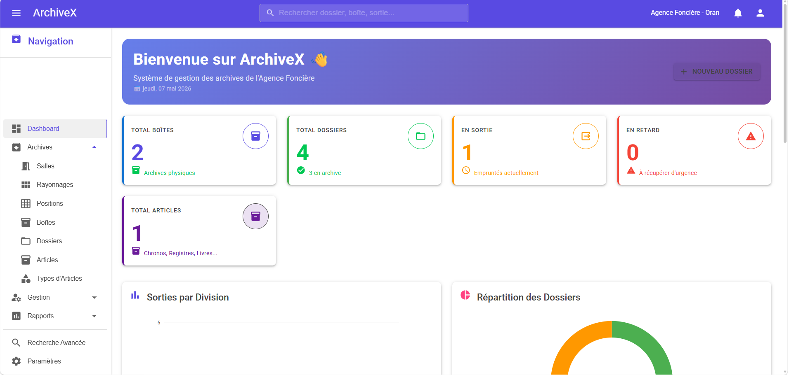
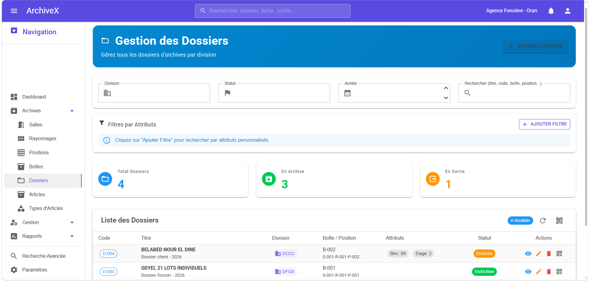
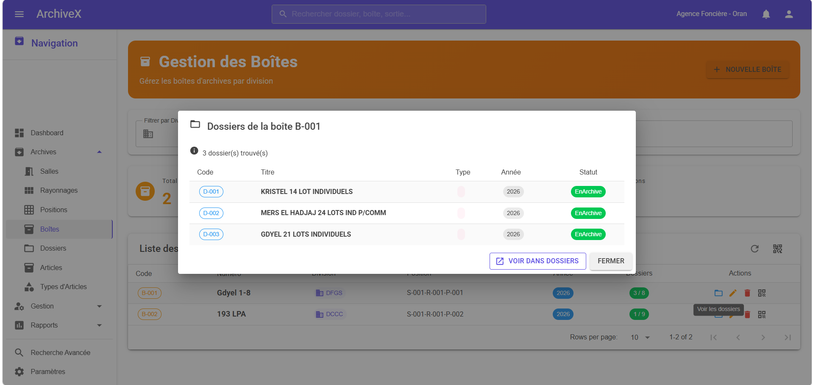
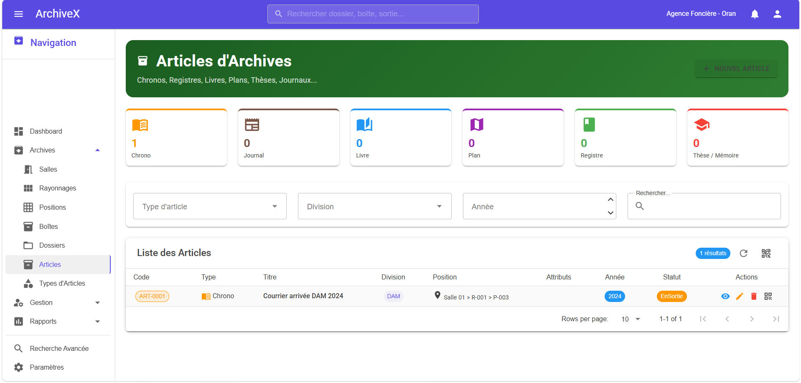
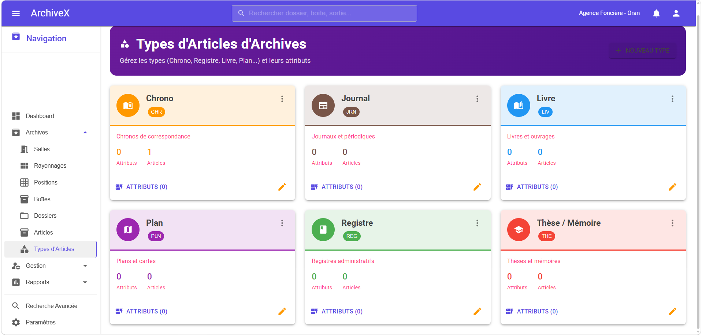

# 🗄️ ArchiveX - Archive Management System

> Web application developed for the **Agency for Urban Land Management and Regulation of the Wilaya of Oran, Algeria**


---

## 📸 Screenshots

<table>
  <tr>
    <td align="center" width="33%">
      <a href="screenshots/01-dashboard.png">
        
      </a>
      <br/><strong>Dashboard</strong>
    </td>
    <td align="center" width="33%">
      <a href="screenshots/02-dossiers.png">
        
      </a>
      <br/><strong>Files Management</strong>
    </td>
    <td align="center" width="33%">
      <a href="screenshots/03-boites.png">
        
      </a>
      <br/><strong>Boxes Management</strong>
    </td>
  </tr>
  <tr>
    <td align="center">
      <a href="screenshots/04-sorties.png">
        
      </a>
      <br/><strong>Checkouts Management</strong>
    </td>
    <td align="center">
      <a href="screenshots/09-bon-sortie.png">
        
      </a>
      <br/><strong>Checkout Slip</strong>
    </td>
    <td align="center">
      <a href="screenshots/06-recherche.png">
        
      </a>
      <br/><strong>Advanced Search</strong>
    </td>
  </tr>
  <tr>
    <td align="center">
      <a href="screenshots/07-articles.png">
        
      </a>
      <br/><strong>Archive Articles</strong>
    </td>
    <td align="center">
      <a href="screenshots/08-Types-articles.png">
        
      </a>
      <br/><strong>Archive Articles Types</strong>
    </td>
    <td align="center">
      <a href="screenshots/09-rapports.png">
        
      </a>
      <br/><strong>Reports & Statistics</strong>
    </td>
  </tr>
</table>

> 💡 *Click on any image to view full size*

---

## 📋 About

**ArchiveX** is a modern and professional web-based archive management system built with **Blazor Server** and **MudBlazor**. It provides a complete solution for managing, tracking, and tracing all physical and digital archive assets of the agency.

---

## 🚀 Features

### 🏗️ Hierarchical Archive Structure
- ✅ **Rooms** → **Shelves** → **Positions** → **Boxes** → **Files**
- ✅ Automatic codification for each element
- ✅ Precise location tracking of every document
- ✅ Real-time occupancy rate per room

### 📁 Files Management
- ✅ Files with dynamic attributes per division
- ✅ Advanced multi-criteria search
- ✅ Filter by division, type, year, status
- ✅ Digital attachments (PDF, images, Word, Excel)
- ✅ QR code labels (60x40mm thermal format)

### 📚 Archive Articles Module
- ✅ Chronos, Registers, Books, Plans, Theses, Newspapers
- ✅ Fully dynamic and customizable article types
- ✅ Type-specific attributes (ISBN, Author, Scale, etc.)
- ✅ Digital scanned document attachments

### 📤 Checkout Management
- ✅ 4-step workflow: Requester → Selection → Slip → Validation
- ✅ Multiple files AND articles per checkout request
- ✅ Separate tracking of the person who physically retrieves documents
- ✅ Automatic return deadline calculation
- ✅ Overdue alerts and notifications
- ✅ Individual or bulk return processing
- ✅ Printable professional checkout slip

### 🖨️ Labels & QR Codes
- ✅ Printable checkout slip with customizable header
- ✅ QR Codes for boxes, files, articles (60x40mm)
- ✅ Shelf labels in A4 format
- ✅ Position labels in 60x40mm format
- ✅ Individual or batch printing
- ✅ Compatible with XPrinter thermal printers

### 📊 Dashboard & Reports
- ✅ Real-time dashboard with SQL view optimization
- ✅ Interactive charts (bar, donut)
- ✅ Statistics by division
- ✅ Monthly and annual reports
- ✅ Overdue reports with date range filters
- ✅ Printable professional reports (A4)

### 🔍 Search
- ✅ Global search in the AppBar (auto-complete)
- ✅ Advanced search with multiple filters
- ✅ Search within dynamic attributes
- ✅ Search in article attributes (ISBN, Author...)

### ⚙️ Settings
- ✅ Customizable organization name
- ✅ Default return deadline
- ✅ Full agency configuration

---

## 🛠️ Tech Stack

| Technology | Usage |
|------------|-------|
| **ASP.NET Core 8** | Backend framework |
| **Blazor Server** | Frontend framework |
| **MudBlazor** | Material Design UI library |
| **Entity Framework Core** | ORM |
| **MySQL** | Database |
| **JavaScript** | Printing, QR codes, barcodes |
| **QRCode-Generator** | Local QR code generation |

---

## 🏗️ Architecture

```
📁 ArchiveX
├── 🎨 Components/
│   ├── Pages/
│   │   ├── Dashboard/        📊 Dashboard with charts
│   │   ├── Salles/           🏢 Rooms management
│   │   ├── Rayonnages/       📚 Shelves management
│   │   ├── Positions/        📍 Positions management
│   │   ├── Boites/           📦 Boxes management
│   │   ├── Dossiers/         📁 Files management
│   │   ├── Articles/         📖 Archive articles
│   │   ├── TypesArticles/    🏷️ Article types
│   │   ├── Sorties/          📤 Checkouts management
│   │   ├── DemandesSorties/  📝 Checkout requests
│   │   ├── Rapports/         📈 Reports
│   │   ├── Recherche/        🔍 Advanced search
│   │   └── Parametres/       ⚙️ Settings
│   └── Layout/
├── 📦 Models/                 Data entities
├── ⚙️ Services/               Business logic
├── 💾 Data/
│   └── Repositories/         Data access layer
└── 🌐 wwwroot/
    ├── js/                    Print & QR scripts
    └── uploads/               File attachments
```

---

## 💾 Database Schema

```
🏢 Rooms
  └── 📚 Shelves
        └── 📍 Positions
              ├── 📦 Boxes
              │     └── 📁 Files
              │           ├── 🏷️ AttributeValues
              │           └── 📎 Attachments
              └── 📖 ArchiveArticles
                    ├── 🏷️ ArticleAttributeValues
                    └── 📎 Attachments

📤 CheckoutRequests
  ├── 📁 FileLines (Files)
  └── 📖 ArticleLines (Articles)

👥 Divisions ──── Requesters
📋 FileTypes ──── ArticleTypes
                    └── 🏷️ ArticleAttributes
```

---

## 🗃️ Database Views (Performance Optimization)

```sql
v_dashboard_stats      -- General statistics
v_sorties_en_cours     -- Active checkouts
v_stats_par_division   -- Statistics by division
v_articles_par_type    -- Articles by type
v_occupation_salles    -- Room occupancy rates
```

---

## 📱 Deployment

- 🖥️ **Windows Server** with Kestrel web server
- 🗄️ **MySQL** database via WampServer
- 🌐 Accessible on the local network via `http://SERVER_IP:5000`
- 🚀 Automatic startup on server boot

---

## 🏢 Divisions Supported

| Code | Division |
|------|----------|
| DIV-ADM | Administration & Resources Division |
| DIV-FIN | Finance & Accounting Division |
| DIV-FON | Land Management Division |
| DIV-AMT | Planning & Works Division |
| DIV-COM | Commercial & Client Control Division |
| DIV-AUD | Audit Division |
| DEP-AJU | Legal Affairs Department |
| DEP-CTM | Contracts & Markets Department |
| DIR | General Management |

---

## 👨‍💻 Developer

**[SID AHMED KHIAT]** - Developer with AI Assistant

[](https://www.linkedin.com/in/sid-ahmed-khiat/)
[](https://github.com/sidot411)
[](khiatsidahmed1708@email.com)

---

## 📄 License

This project is **proprietary** and developed for internal use by the Urban Land Agency of Oran.

> 💡 *This repository contains only screenshots and project documentation for portfolio purposes. The source code is in a private repository.*
