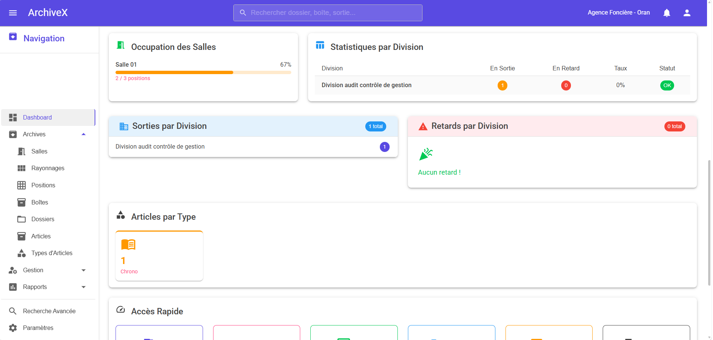
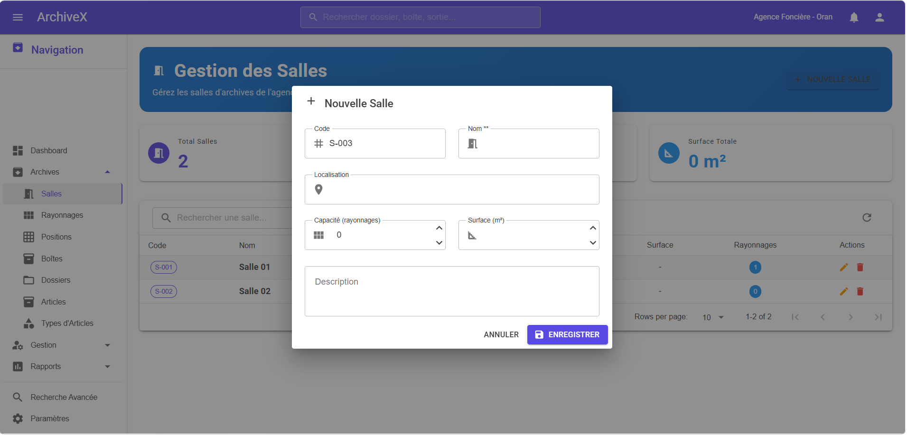
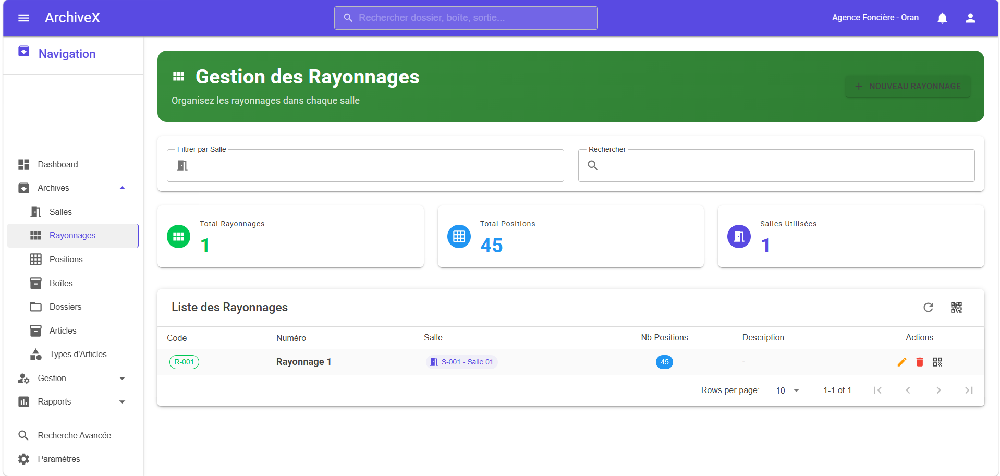
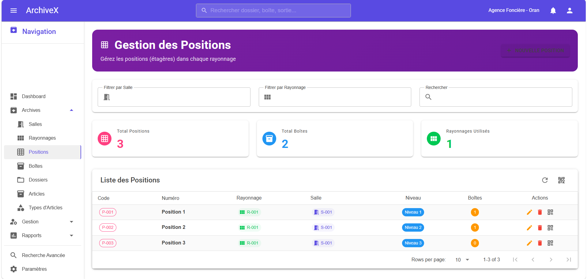
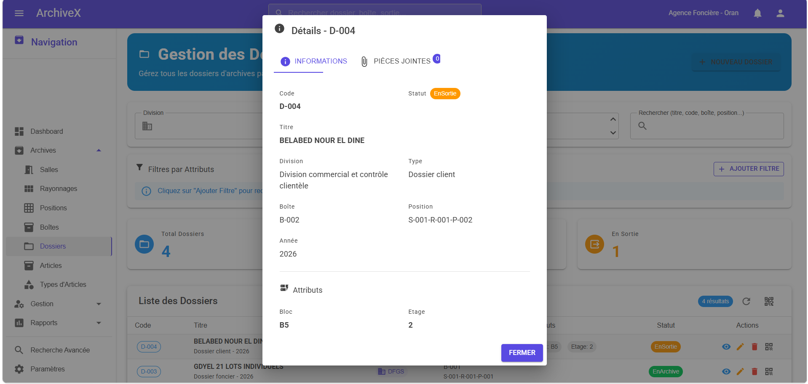
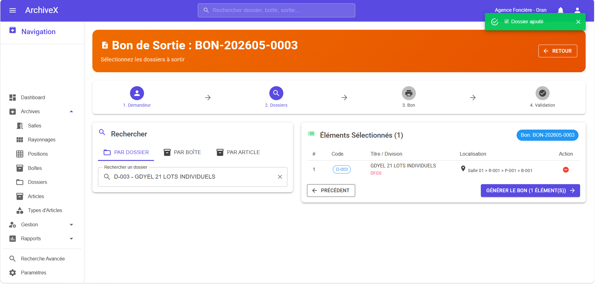
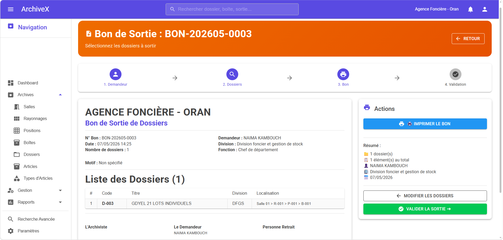
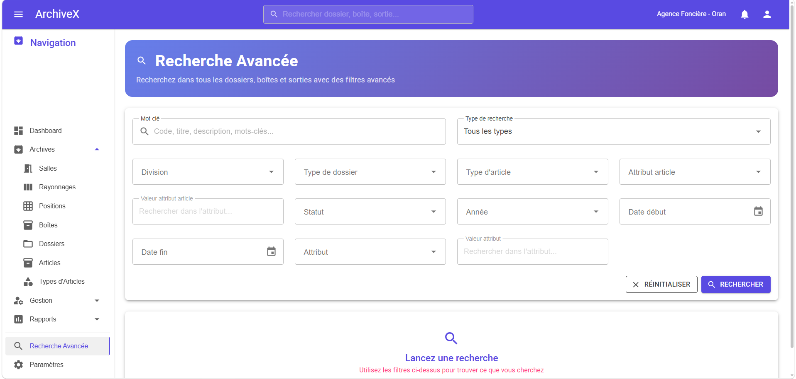

# 🗄️ ArchiveX - Système de Gestion des Archives

> Application web développée pour l'**Agence de Gestion et de Régulation Foncière Urbaine de la Wilaya d'Oran**

---

## 📸 Aperçu

### Dashboard



### Salles


### Rayonnages


### Positions


### Gestion des Dossiers



### Gestion des Boîtes


### Gestion des Sorties


### Bon de Sortie (Impression)


### Recherche Avancée


### Types d'Articles avec Attributs Dynamiques


---

## 🚀 Fonctionnalités

### 🏗️ Gestion Hiérarchique des Archives
- ✅ **Salles** → **Rayonnages** → **Positions** → **Boîtes** → **Dossiers**
- ✅ Codification automatique de chaque élément
- ✅ Localisation précise de chaque document

### 📁 Gestion des Dossiers
- ✅ Dossiers avec attributs dynamiques par division
- ✅ Recherche avancée multi-critères
- ✅ Filtrage par division, type, année, statut
- ✅ Pièces jointes numérisées (PDF, images)

### 📚 Module Articles d'Archives
- ✅ Chronos, Registres, Livres, Plans, Thèses, Journaux
- ✅ Types d'articles dynamiques et personnalisables
- ✅ Attributs spécifiques par type (ISBN, Auteur, Échelle...)
- ✅ Pièces jointes numériques

### 📤 Gestion des Sorties
- ✅ Flux en 4 étapes : Demandeur → Sélection → Bon → Validation
- ✅ Sortie de plusieurs dossiers ET articles en une demande
- ✅ Gestion de la personne qui retire les documents
- ✅ Délai de retour avec calcul automatique
- ✅ Alertes de retard automatiques
- ✅ Retour individuel ou groupé

### 🖨️ Impression et QR Codes
- ✅ Bon de sortie imprimable (en-tête personnalisable)
- ✅ QR Codes pour boîtes, dossiers, articles (format 60x40mm)
- ✅ Étiquettes rayonnages format A4
- ✅ Étiquettes positions format 60x40mm
- ✅ Impression individuelle ou groupée

### 📊 Dashboard et Rapports
- ✅ Tableau de bord en temps réel
- ✅ Graphiques (barres, donut)
- ✅ Statistiques par division
- ✅ Rapports mensuels et annuels
- ✅ Rapport des retards
- ✅ Impression des rapports

### 🔍 Recherche
- ✅ Recherche globale dans l'AppBar
- ✅ Recherche avancée avec filtres multiples
- ✅ Recherche dans les attributs dynamiques

### ⚙️ Paramètres
- ✅ Nom de l'organisme personnalisable
- ✅ Délai de retour par défaut
- ✅ Configuration complète de l'agence

---

## 🛠️ Technologies Utilisées

| Technologie | Description |
|-------------|-------------|
| **ASP.NET Core 8** | Framework backend |
| **Blazor Server** | Framework frontend |
| **MudBlazor** | Bibliothèque UI Material Design |
| **Entity Framework Core** | ORM base de données |
| **MySQL** | Base de données |
| **JavaScript** | Impression, QR Codes, Codes-barres |
| **QRCode-Generator** | Génération QR codes locale |

---

## 🏗️ Architecture

```
ArchiveX/
├── Components/
│   ├── Pages/
│   │   ├── Dashboard/
│   │   ├── Salles/
│   │   ├── Rayonnages/
│   │   ├── Positions/
│   │   ├── Boites/
│   │   ├── Dossiers/
│   │   ├── Articles/
│   │   ├── TypesArticles/
│   │   ├── Sorties/
│   │   ├── DemandesSorties/
│   │   ├── Rapports/
│   │   └── Parametres/
│   └── Layout/
├── Models/
├── Services/
├── Data/
│   └── Repositories/
└── wwwroot/
    ├── js/
    └── uploads/
```

---

## 📋 Schéma de la Base de Données

```
Salles
  └── Rayonnages
        └── Positions
              ├── Boites
              │     └── Dossiers
              │           ├── ValeursAttributs
              │           └── PiecesJointes
              └── ArticlesArchives
                    ├── ValeursAttributsArticles
                    └── PiecesJointes

DemandesSorties
  ├── LignesDemandesSorties (Dossiers)
  └── LignesArticlesSorties (Articles)

TypesDossier ──── Divisions ──── Demandeurs
TypesArticles
  └── AttributsArticles
```

---

## 📱 Déploiement

L'application est déployée sur un **serveur Windows local** avec :
- **Kestrel** comme serveur web
- **WampServer** pour MySQL
- Accessible depuis tous les PC du réseau via `http://IP_SERVEUR:5000`

---

## 👨‍💻 Développeur

Développé par **[Votre Nom]**

[
[

---

## 📄 Licence

Ce projet est **privé** et développé pour usage interne de l'Agence Foncière d'Oran.

> 💡 *Ce repository contient uniquement des captures d'écran et la description du projet. Le code source est privé.*
